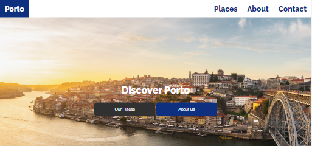
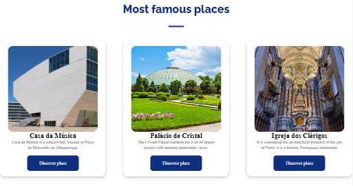
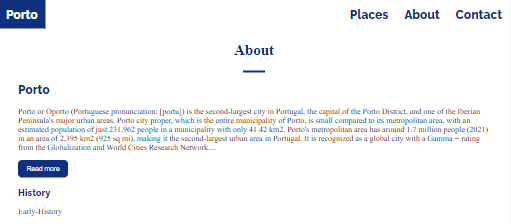
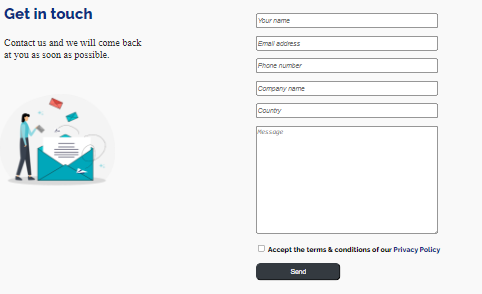

# Discover Porto

Repository to host the project developed for Tecnologias da Internet, a fisrt year subject at Universidade da Maia. Developed by INF-21-TI-G20 Group : [@DiogoAlves](https://github.com/Diogojqalves), [@Bruno Ribeiro](https://github.com/a040225), [@José Mário](https://github.com/mendesjosemario).
Organization [@inf-21-ti-g20](https://github.com/inf-21-ti-g20/inf-21-ti-g20)

## Porto

The theme that we developed in the final work of Internet Technologies is the city of Porto within the scope of the theme “Tourism”. The website consists of four pages that aim to promote tourism in the "Invicta" city.
On the first screen (landing page) we intend to present a “hero” component with a panoramic background-image of the city of Porto with the slogan “Discover Porto”, an informative component and a section with an input to subscribe to a newsletter.
On the third screen, we intend to develop our “About” page with detailed information about Porto (origin of the city's name, history, climate table) using blockquote and table elements.
The fourth and final screen will be the Contact page, consisting of a contact form with the following inputs: name, email, number, company name, country, message, accept terms, send; a component with the website's contact details (eg office location) and a “download” button to extract the XML file.
All pages were planned with the same navbar and footer, and in the footer we decided to include the logo of Universidade da Maia and Turismo Portugal.

## Repository organization

- **Source code** is in the [src folder](src/). Which includes a [js folder](src/js), a [images folder](src/images) and a [css folder](src/css).
- Report chapters are in [doc folder](doc/).

## Gallery

|                                                    |                                                     |
| :------------------------------------------------: | :-------------------------------------------------: |
|  |  |
|                      Homepage                      |                     Places Page                     |

|                                                    |                                                      |
| :------------------------------------------------: | :--------------------------------------------------: |
|  |  |
|                     About Page                     |                     Contact Page                     |

## Technologies

_The technologies used in this assignment are:._

- XML
- HTML5 + CSS3
- Javascript

### Frameworks and Libraries

_No library was used in this assignment._

### Project presentation

- Chapter 1: [Project presentation](doc/c1.md)

### User Interface

- Chapter 2: [User Interface Prototype and Sitemap](doc/c2.md)

### Product

- Chapter 3: [Product](doc/c3.md)

### Presentation

- Chapter 4: [Presentation](doc/c4.md)

## Team

- Diogo José Queirós Alves, a041050@ismai.pt [@DiogoAlves](https://github.com/Diogojqalves)
- Bruno Manuel Pinto Ribeiro, a040225@ismai.pt [@Bruno Ribeiro](https://github.com/a040225),
- José Mário de Azevedo Mendes, a040866@ismai.pt [@José Mário](https://github.com/mendesjosemario)
