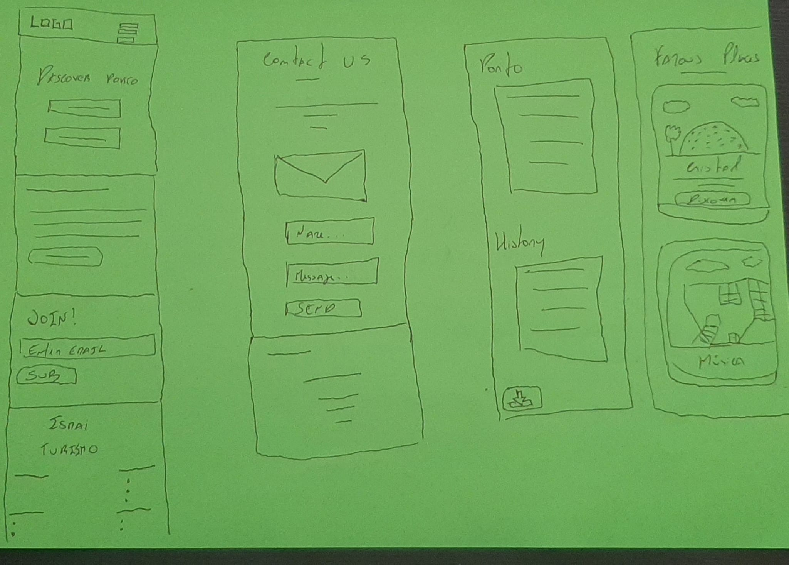
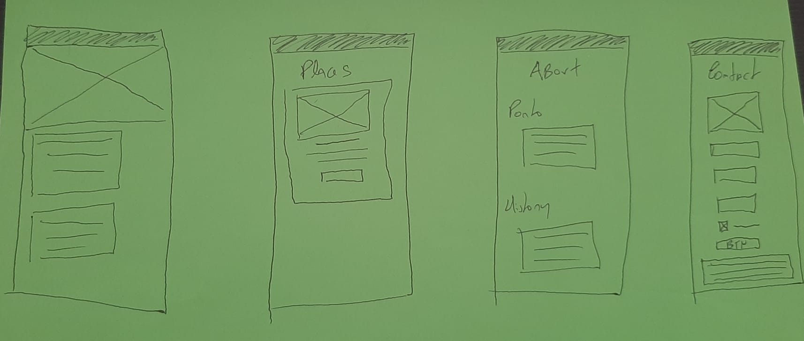
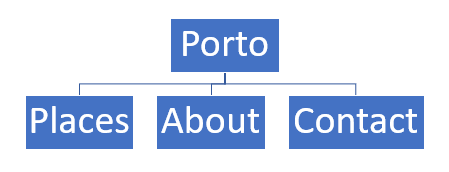

# C2 : User Interface

_The website was designed under the "Mobile first" rule and inspired by the Porto city colors. In the sections bellow we show you our design process_

## Interface and Common features

The header and footer are common between all pages.

### Sketchs

_Your sketch_

| |
:---:
 |
1 - MainPage; 2- Contact Page; 3 - About Page; 4 - Places Page|

### Wireframes

_Your wireframes with a description_

| |
:---:
 |
1 - MainPage; 2- Places Page; 3 - About Page; 4 - Contact Page|

### Sitemap

  
The website consists of 4 pages, Porto is the homepage and through the header the user can access all pages.

---

| [< Previous](c1.md) | [^ Main](../../../) | [Next >](c3.md) |
| :------------------ | :-----------------: | --------------: |
