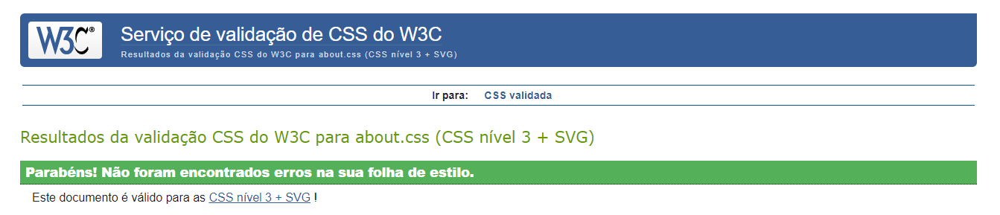
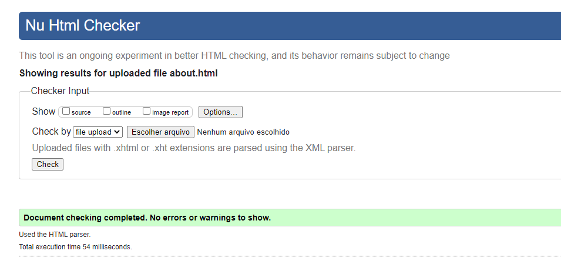

# C3 : Product

_Porto Page is the homepage of the website which includes a panoramic picture of the city of porto and a form to subscribe to the city newsletter_
_Places Page contains images and descriptions of the most popular places to visit in Porto_
_About Page contains facts about the Porto city such as the origin, the localization an_one of its most famous dish._
_Contact Page contains a contact form and the location of our offices_

## 3.1 Instalation

_You can either checkout the project in Github or download it as a zip file._
_Once you have access to the source code, no package needs instalation, you just open of the html files on the browser and you´re ready to go._

## 3.2 Deploy

_To deploy your project on netlify:_

- First Login and on https://app.netlify.com, Click the Add a new Project button.
- Link to Your Github.
- Authorize Netlify.
- Select your repo.
- Configure your settings.
- Wait for netlify to complete the npm build command.
- Head to the overview and update the generated name for your website by visiting the settings tab and clicking "Change Site name".

## 3.3 Usage

_Their is no required authentication method, all the forms are static and only for presentation purposes._

## 3.4 Application/Product help

_Each page has a title that identitifies your current location on the website_  
_To move around the website you have a hamburguer menu (mobile version) that opens a list with the website pages._

## 3.5 Forms

_All the forms are static and only for presentation purposes.._

## 3.6 CSS3 validation

_To validate CSS we used W3 validator._

| |
:---:
 |

## 3.7 HTML5 validation

_To validate HTML we used W3 validator._

| |
:---:
 |

## 3.8 Implementation details

_Miminum required objectives and valorization elements added to our work._

- 1 XML Document, in ./src/xml
- 4 Static Pages in ./src
- Table Example in ./src/about.html, starting at line 137
- List Example in the footer element
- Use of img in the footer element
- Use of figure in ./src/about.html, line 562.
- Image insertion through css in ./src/css/homepage.css, line 14
- Css in ./src/css
- Javascript Manipulation in ./src/js to toogle nav style and read more/less button

---

| [< Previous](c2.md) | [^ Main](../../../) | [Next >](c4.md) |
| :------------------ | :-----------------: | --------------: |
